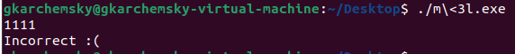

# Microsoft ❤️ Linux

Microsoft's latest addition to the world of Open Source: a flag checker...

[m<3l.exe](m_3l.exe)

# solution

so in this challenge we get a file with `.exe` extension, 
if we try to run it - we will fail with the next error:


if we run `file` against it, we get:

```shell
gkarchemsky@:~/Desktop$ file m\<3l.exe 
m<3l.exe: ELF 32-bit LSB executable, Intel 80386, version 1 (SYSV), statically linked, no section header
```

I tried to open it with ida, and it had some errors:


so, I wasn't sure if the file is corrupted or not, but I manged to execute it on linux:



then I used gdb to debug the code, and I figured out that 
there is a data buffer that is compared against my input, one byte at a time after
rotating my byte's bit to the left by 13. <br>

that can be also seen using IDA:


So I copied the 18 bytes from the buffer locating above the other data:


and did the reverse operation which ended up
giving me the first half of the flag:


now I was stuck a bit because I tired to disassemble different areas of the code
from the binary to 32-bit instruction,
but then I remembered what was written in the error that I got by running the executable in windows...

I need to disassemble the code to 16-bit instruction!
so I did and ended up with the next code:


this time, the user's input is being compared to the next 18 bytes
that were after the linux's 18 encoded bytes. <br>
but this time the user's bytes were xored with the value of 13 before the comparison.

I also did the reverse thing to get the second half of the flag
and ended up with the whole flag which was:

`corctf{3mbr4c3,3xt3nd,3Xt1ngu15h!!1}`
