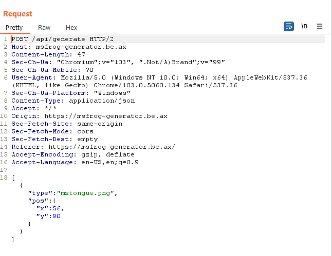
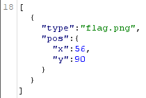
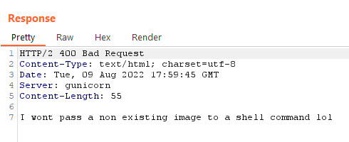
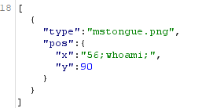
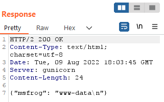
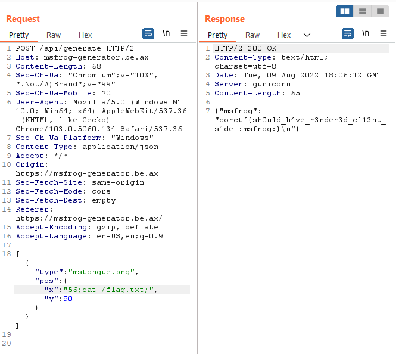

# msfrog-generator

The vanilla msfrog is hard to beat, 
but this webapp allows you to make it even better!
[https://msfrog-generator.be.ax/](https://msfrog-generator.be.ax/)

# solution

this is the site:


you can add emojis to the frog and then click generate. <br>
You can find the next message in the html source code:

```html
<!-- NOTE: There is no (intended) vuln in the frontend, please don't waste your time digging into the JS ;)  -->
```

let's check the request that is sent by clicking the `Generate` button:



maybe lets gey and place `flag.png` ?



now I get different response:



we are given a hint that this string is passed to a shell command,
after trying to use the `type` field of the json to inject command unsuccessfully,
we tried to inject command using the other variables that are passed, for example: the `x` variable:



and we get successful output!



now we know how to execute a command to read the flag:



the flag is:

`corctf{sh0uld_h4ve_r3nder3d_cl13nt_s1de_:msfrog:}`
