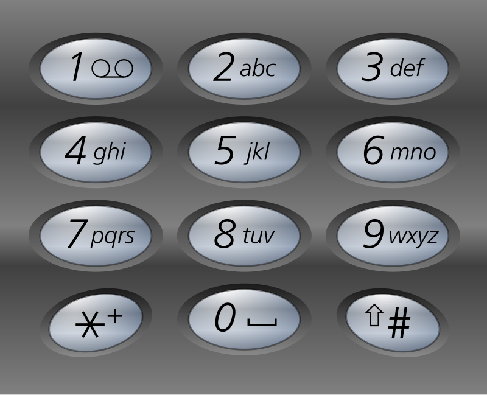

# Tring Tring....

Tring Tring my mobile started ringing.
"Hey Check your SMS!!"

----. ----. ----. / -.... -.... -.... / ---.. ---.. / ..--- ..--- ..--- / ..--- / -.... -.... / --... --... --... / ...-- ...-- / ..--- / ...-- / -.... / ----. ----. ----. / --... --... --... --... / -.... / --... --... --... --...

Flag Format: SHELL{SOMETHINGHERE}

# solution

We can take the morse code we got and decode it using
[this](https://www.google.com/search?client=safari&rls=en&q=decode+morse&ie=UTF-8&oe=UTF-8) site,
and we will get the next output:

`999 666 88 222 2 66 777 33 2 3 6 999 7777 6 7777`

I wasn't sure if I got the right output of not because at first this output didn't make sense.
But, the hint was relating to a mobile, and I understood that you could extract a text from this output because
it represents the buttons you need to press to ge the right letter in an old mobile phone like this:

you can decode the message using [this](https://www.dcode.fr/multitap-abc-cipher) site,
and you will end up with `YOUCANREADMYSMS`,
so the flag is:

`SHELL{YOUCANREADMYSMS}`
 