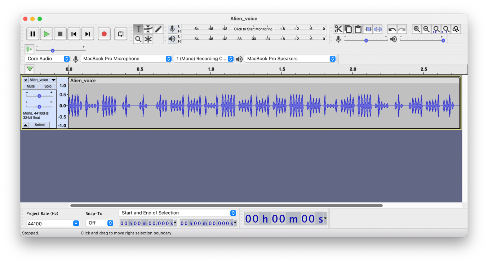

# Alien Communication

Aliens are trying to communicate something.
They believe in seeing more than what they are hearing.
can you help us trying to decode what they are trying to say?

[Alien_voice.wav](Alien_voice.wav)

# solution

This time I got a `.wav` file that was encoded with a flag, I used `Audacity` to open the file:

at first, it doesn't look interesting, but if we open it in a spectrogram view:

We can see that the flag is:

`shell{y0u_g07_7h3_f1a9}`
