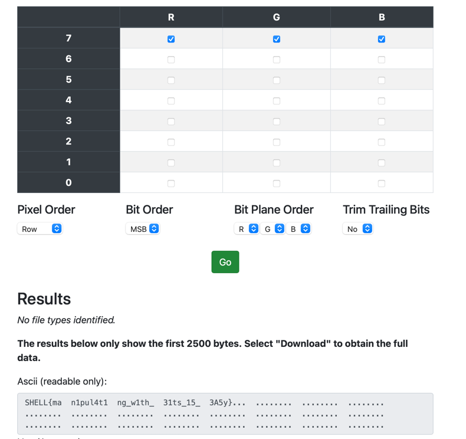

# Heaven

"I was in the seventh heaven painted red green and blue"

Flag Format: SHELL{s0mething_here}

[Seventh_Heaven_Image.jpeg](Seventh_Heaven_Image.jpeg)

# solution

In this challenge we are given an image which probably has the flag encoded into it.
I am familiar with hiding data in LSB of every byte in an image, so I wanted to try
and extract data this way. 
So I used [this](https://stegonline.georgeom.net/upload) site to check it:

and I was sure did was encoded this way, and the flag is:

`SHELL{man1pul4t1ng_w1th_31ts_15_3A5y}`
