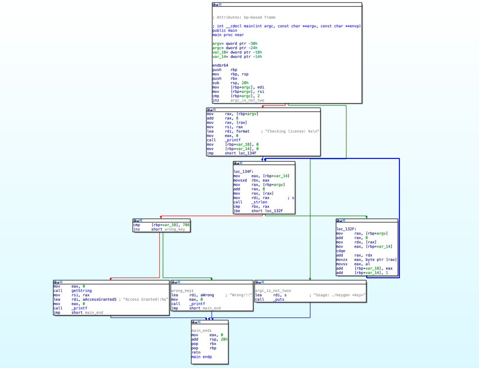
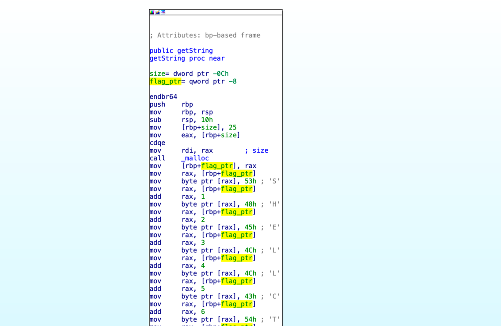

# Keygen

Enter the license key and get the flag.
Simple right ? 

Flag Format:SHELLCTF{}.

[keygen](keygen)

# solution

let's run `file` against the given file:

```bash
keygen: ELF 64-bit LSB pie executable, x86-64, version 1 (SYSV),
dynamically linked, interpreter /lib64/ld-linux-x86-64.so.2,
BuildID[sha1]=41ce2466a43df9ab59e1ebcabaa6c52fc23b6cdc,
for GNU/Linux 3.2.0, not stripped

```

so we have a 64-bit elf binary, let's open it using IDA Pro and take a look at main:



we can see that if we enter a right key, the function `getString` is called, lets check it:



what this function does is allocating a buffer for the flag and then copying the flag into this
buffer one byte at a time, we can concatenate the characters and get the flag:

`SHELLCTF{k3ygen_1s_c0oL}`
