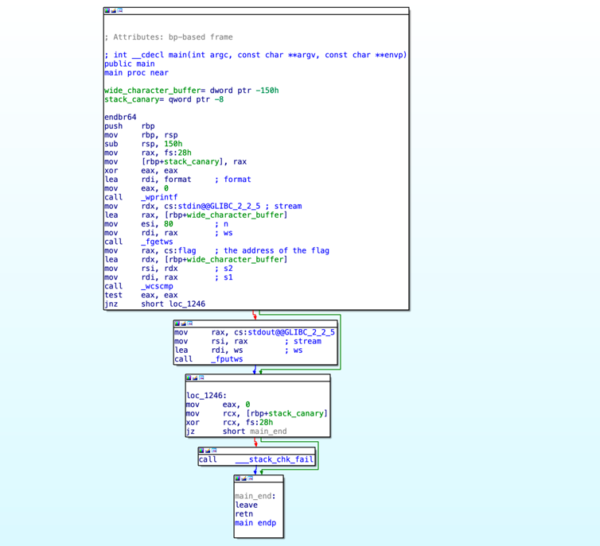
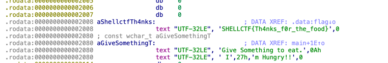

# Pulling the strings

Can you please feed me something? 

[pullingthestrings](pullingthestrings)

# solution

let's run `file` against the given file:

```bash
pullingthestrings: ELF 64-bit LSB pie executable, x86-64, version 1 (SYSV),
dynamically linked, interpreter /lib64/ld-linux-x86-64.so.2,
BuildID[sha1]=25282fd217f6304173252ba522b3f57360fab8d5, for GNU/Linux 3.2.0,
not stripped
```

so we have a 64-bit elf binary, let's open it using IDA Pro and take a look at main:



we can see that the user buffer is later compared with the flag address that is stored 
in the program using the `wcscmp` function, the flag is encoded in a 32-bit character format:



the flag is:

`SHELLCTF{Th4nks_f0r_the_food}`
