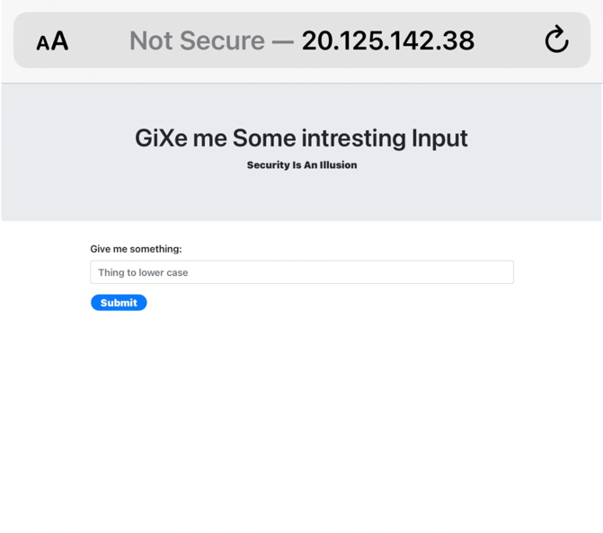
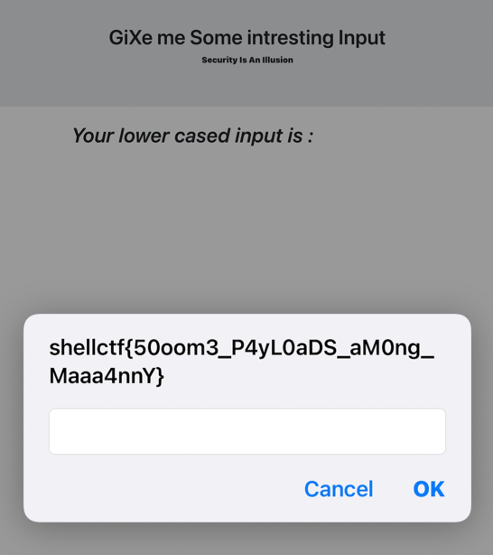

# Choosy

Single solution doesn't works on all problems.
One should try different solutions for different problem.

Flag format:- shellctf{H3re_1s_tH3_F14g}

# solution

We get a link to a site:

when you enter a message it turns all the upper case letter to lower case letters.
and if you try to write the word script - the site removes this.
There are many ways to try and get an XSS, one of the payloads I used was:

``

which resulted in the following output:

so the flag is:

`shellctf{50oom3_P4yL0aDS_aM0ng_Maaa4nnY}`
