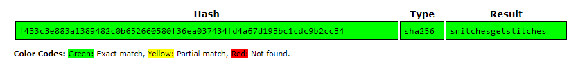

# MAFIOSO

A soldier was walking around the streets of Sicily, late at night, with THE Consigliere.
Same soldier, the very next day, found in a ditch with a note in his breast pocket.

It read:

`f433c3e883a1389482c0b652660580f36ea037434fd4a67d193bc1cdc9b2cc34`

Flag format: `TFCCTF{secret_message}`

# SOLUTION

we got a string that looks like a hash, I used a hash analyzer site
like [this](https://www.tunnelsup.com/hash-analyzer/)
to understand that I am facing a `SHA2-256` hash type.

next, I searched online for a SHA256 site that I can use to get the text that reproduced this hash,
based on dictionary hash attack, like [this](https://crackstation.net/) site.

the result was:

and the flag is:

`TFCCTF{snitchesgetstitches}`
