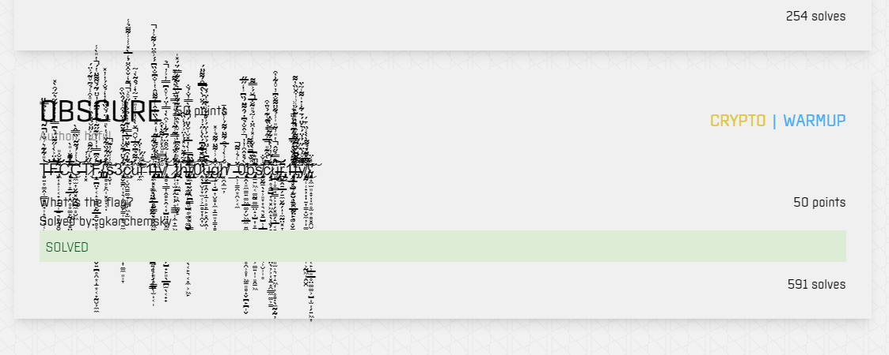
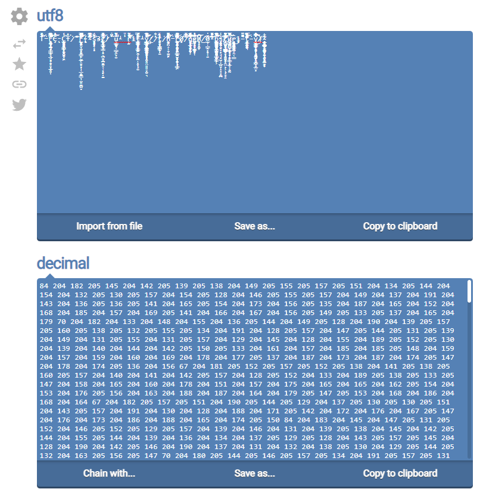
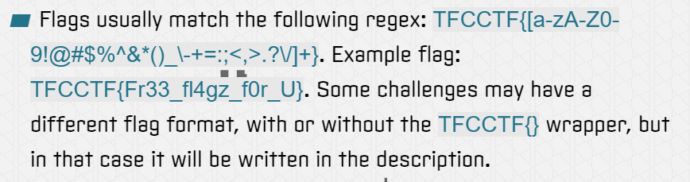
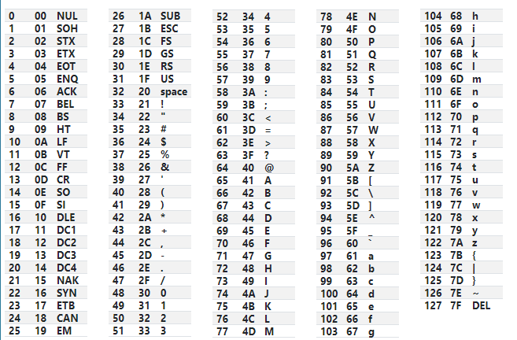

# OBSCURE

T̶̨̧͈͍̥͚̭̜͇̻̥̘̹̝̩͍̦̜͕͉̥̳͑̎͋͊͛͗̆͐̄͂̀̒͛̉̿̏̈̕̚̚̕͝͝͝ͅF̶̡̛̛͖̝̹̹͔̟̝̟̠̩̲̱͉̻̭̻̮͓̲̮͈̜̅̔̈͐̀̾̋͊̈́͛͆̿̀̓͐̓͋̃͛̃́̑̀̽͂̋̌̐̎̕̕͘͝͠͝͝ͅC̵̢̨̨͓̞̥̠̲̗̝̯̥̥͚̙̰̣̼̻̤̳͓͙̺̤͊̍͊̌̍̎̀̅̽͊͘͘͘͜͝͠͝͝ͅÇ̶̼̫͎̬̰͓̰̭̺̼̥̮͖͗̾͐́̉͂͂͗̏̿̂̀͝͝Ṭ̷̛͓̑̓̓̒́̋̒̃̋͊̑̎͐͐̋̈̆̉́̀̏͑̀̾̎͒̾̉̃̄̊͂́͐̈́͘͘͜͝͝F̴̢̨̡̛̥̠̪̤̞͔̝̞̳̱̙̰̲̙̠̬̻̥̜͔̲̯͚̳̖̩̺͈̬͍̪̥̯͙̱͙͔̞̰̮̦̼̼͐͒͆̿̓̓͑̎͊̋͂͑̅̈́͗̃͆͊̓̆̈́͂́̆͌͂̈̔́̔̎̀̾̕̕̚͝͝͝͝͠ͅ{̴̧̡̡̛͈̻̥̙̯̜͓̥̣͔̣͐̄̂̋͋̏͋̌̍̔̀̎̿̍̈́̐̏͒̓̒̉̐́̓̓̽̕̕͝͠s̴̝̬͒̾͗̌̓͊̚ͅ3̷̢̧͓̬̳̯̜̦͉̜̗͚̗̳̩̻͉͍̼͓͍̼͚̝͔͙̗̞͎͚̼͈̹̞͋̉̆̈́͊̐̓̔͋̈͂́̔̈́͒͗̀́̂̏͒͜͝ç̷̛͉͔̮̯̳͚̘̜͇̗͖̟̫̇͋̇̑͆̀͊̈̌̅̀̿̓͊̓̀̉́̀̓̋̊͐͊̒̌͒͒̈́̒̅̀̽̾͗̾͌̃̉̾̚̚̕̕͝͝ư̵̼̑̔͌̉͆͒̅͗̆̑̌̀̀͗̒̾̎͆̇̄̃̀̒̉̂͂̀̍̃̄̈͐̈́̔̔̈́̽̚͘̕͘ͅr̵̛̼͊̽̔̋͠1̶̧̡̨̡̢̧̡̛̗̼͓̣͖̖̖̫̲̻̰͇̫̘̖̞͖̬̤͔̙̠̪̦͙̮̝̫͔͕͈̗̙͇̫̩̫͔̩͂̾͆̈́̂̌͋̕͜͜ͅͅṭ̶̡̢̢̧̨̡̡̨̧̨̛͔̜̳̥̤̰̖̩̟̬̰̖̥̹̼͈̦̥̣͇̭͎̻̻͔̪͍̻̜͎͉͙͇̣̿̑̂̈́̇̉̄͑̅͂͐̒̽́̀̏̓̂͑͐͌̈̂̔͑̐͆̐̏͆́́̾̑̈́͑͌͐̓̊̕̚͘͜ͅẙ̸̢̨̛̹̻͉͇͎̭̻̙̭͔͎̺̤̤̻͓̼̮͈̤͈͈̠̞̪̠͉̗̺̟̙͈̖̲̪̫̖͔̟̟̇̇̿̎̊̀̊̔͌̀̀͒͐͋̀̍̃͒̂̈́͆͋̍͐̑̀̓̿̓̈́͑̊̇͆̿̓͐̓̉̕͘̕̕̚͜͠͝_̷̡̡̨̡̛̛̗̩͔̫̗̭̟̣̗͙͇͇̩̣̼̟̱͖̯̥͎̽͋́̽̈́̎͗̿͊͗͂̒̓͑͛̾̄̿͛̄͛͛́͌͐̀t̷̢̛̰̟̹͖̪̝͕̭̩͚̬̙̃͐̎͐͂͒͆̒̔̊̀͛̂̿̑̀̇͊͋̇̌̅͛̀͂͋̿̈́̈́̽̍̕͝͠͝ḩ̶̢̡̡̛̺͈̺̙͚̪͕͚̹̺̥͚̦͚̺̯̬̣͚͕͔̖̝̞̖͔̙͉͔̟̼͕͖̙̐̃͋̈͛̽́̔̈͐́́̒̏̂̄̊̔̿̍̀̓̅̽̆̍̐̌̈́̋̈́̀̿̓̐́̐͌̓͘̚͘͜͠͝͠͝ͅr̸̢̡͙̼̜̬̤̗̯̪͇̩͓͕͓͓̝͇͖̎͂̏͆͝ͅ0̷̨̛̛̛̛̯̖̞̮̦̞̫̜͕̱̻̞͎̯͎̮͑̿͆̀͛̔͆̈́̈̆̑̄̅͂̇̄́̀́̒̋̇̓̍̀̈́̂̈́̀̀̂̅̅̑́͌̋̈́͘̕̕̕̚͝ų̶̧̡̢̖͓̲̞̭̗̦̠̹̥̙̱̙̥̯̗̭̩͙͔̜̙̼̻̼̞͛̂͆̀̾̃̈́͑̈́̔̈́̾̉̄̌͗̀͊̔̈́̌́͜͠͝͠g̷̢̨̡̜̩̘̺͎̮̻̼͙̱̱͈̣̳̣̻̜͒̓͗̍͌̈́͌̉͑̽̕͝͝ͅh̸̛̛͓̯̣̼̫̦̐͗̀̾̉̅̑́͌̈́͌́͑̔̈́̇̄͘̕͝͝_̶̭̹̩̳̯͙̯͕͔̼̔̈͑̉͗͌̚͜͝0̵̢̧̛͎̭̣͈̼̳͍͚͖̲͚̗̮͖̲̼͍̼̮̖̩͖̫͔̱͓̥̯̹̥͎͖̳͈̻̝̬̪̙̪̩̬̀̉̽̂̑̓̓͐̂̐̉͆̇́̂͌̈́̏͆͗̒̋̅̋̚̕͜͜͜͝͠ͅḇ̵̨̡̨͍͖͔͚̰̠͚͇̤̝̦̺͎͙̱̭̥̼̹̞͓̜̙͕͕͚͍̩͈̭̱͖̍̌̇͆̄̏̃͌͆͛̑̀͑̂̅̍̔̐̾̽̓̑̈̇͑̃̉̎͂̐̅̆́͐̿͌͗̕͘̚̕͘̕̚͘͜͝͝͝ͅͅs̸̡̨̯̬̰̠̖̟̹͈̞͎͉͉͓̠̺̹̣̲̺̬̜̝͓͓̰͍̖̹̮̹̩̥̆̾̐͘ͅç̷̡̩͍̥̘̳̺͎͉͓͖̭̝̖̹̬̗̞̲̞̬̹̼̱̫͓͙̤̤̖̦͕͓̱̝̯͇̼͚͕̳̿͆̀͒͊̎̅͐̂͗̾̀͊͑͊́̊̈͒͂̾́͂̓̓̀̏͋͂̿̆̀͒̇̚͘͝͝ͅü̶̧̨̡̲̩̥͇̘͇̣͕̞̗͓̳̗͉̲͔̻̪̪͕̖͈̪̳̤̤͈̫̹͉̞̝͖͎͕̥̻̣̖̼̰̣̰̦̈̂̿̉̋̂̔̎̓͂̎̍̾̉͂̆̈͌̐͆̓̊͋͑͒̚͜͜͠͝͠͝͝ͅr̵̨̢̨̡̡͓̭͍̲̗͍̼̬̰̗̱̩̼̰̤͓̞̤͔͇͎̪̱̱̺͈̭͆͜ͅ1̶̡̧̨̛͕̟̹͚̹̫̮̖͚̯̲̰̤̙͉͌͆̈́̽̀͗̿̓̑͒̄̌̓̓̓͗̇̒̃̑̏̊͑̋̅̎̔͂͑̔͑̈̄̉̚͘͝ṭ̶̡̼̲͓̺̝̱̮͈̱͈͔̞̙͚̝̬̳͑͌͆̀̆̄͆̀͌͐̂̽̓̾͂̀́͗͗̍͒̆̏̓͌͒͌́̒̑̐́̃͘͝͝ẏ̸̨̡̨̞̰̜̜̟̦͎̣͍͎̳̝̮̼̦͚̮̖͈̺͓̮̲̤͙̞͕̰͖̩̭̮̯̆̌̊́̀̈́̈́̓̈́͛̌̈́́̄͋̍̇̍͌͑̃̀̈̐̋̄̐̈́̉͌̀̀̀͑̏͐̄́̿̅̽͊̉͘͘͜͝͝͠ͅͅ}̴̨̧̡̨̛̛̞̝̼̫͈̝̞̣̣͈̥̫͙̻͓̯̮̻͇̤̦̼͍̱̥̞̥͔̙̹̲͈̲̥̤͚͚͕̺̫̗͍͖͎̆͗̍̈͠ͅͅ

# SOLUTION

the challenge looks like this:

if you will try hard enough you will see the flag partially,
my teammate tried to extract the flag only by looking at this,
but I wanted a smarter way to solve this, an automatic way.
I knew that this string is probably constructed from regular ASCII characters - the flag part,
and from non ASCII characters.
so, what I did to solve this was first converting this message to decimal values
using [this](https://onlineutf8tools.com/convert-utf8-to-decimal) site:

the characters for the flag can only be:

meaning, the only values for the ASCII letters of the flag can be between 20 and 126.

then I used this [site](https://pinetools.com/filter-numbers) to filter the numbers,
and got the next result:

`84 70 67 67 84 70 123 115 51 99 117 114 49 116 121 95 116 104 114 48 117 103 104 95 48 98 115 99 117 114 49 116 121 125`

and when converting the decimal values to ascii I get the flag:

`TFCCTF{s3cur1ty_thr0ugh_0bscur1ty}`
