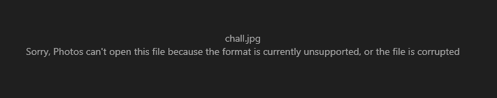
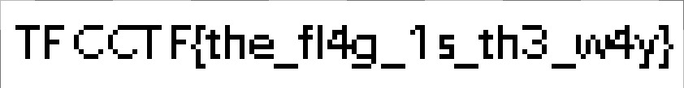

# BBBBBBBBBB

BBBBBBBBBB BBBBBBBBBB BBBBBBBBBB BBBBBBBBBB
BBBBBBBBBB BBBBBBBBBB BBBBBBBBBB BBBBBBBBBB

[chall.jpg](chall.jpg)

# SOLUTION

we got a jpg file, when trying to view it, it looks corrupted:

if we examine the file memory, for example using notepad++.
we can find strings of "BBBBBBBBBB", deleting all of them will make the jpg file a valid one,
and we will get the flag:

