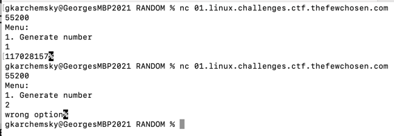
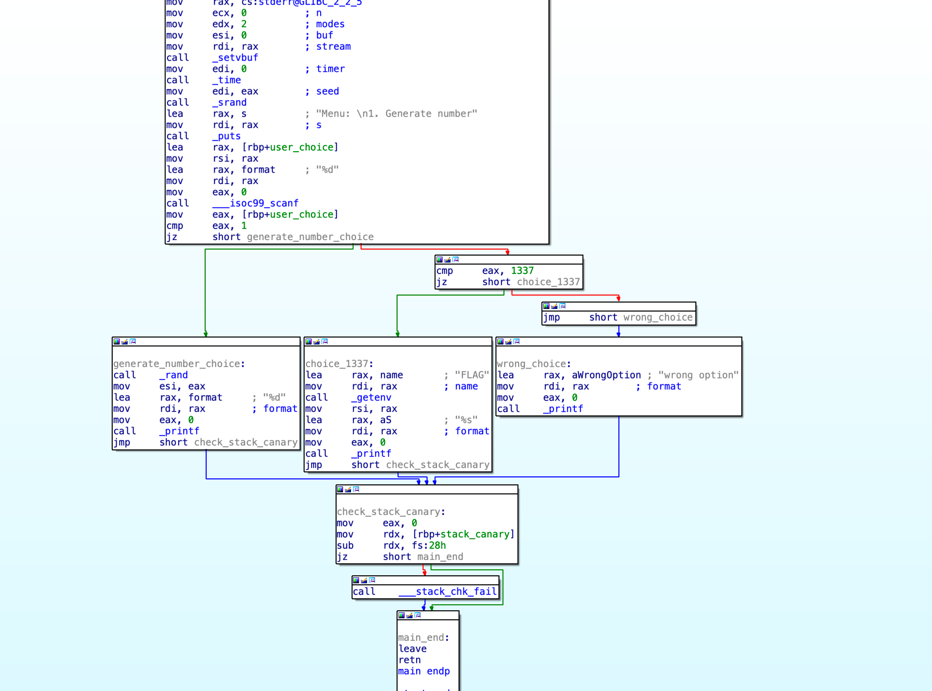

# RANDOM

I created a random number generator as a project.
Unfortunately it only has one option, but I will add more soon (or not)!

`nc 01.linux.challenges.ctf.thefewchosen.com 55200`

# SOLUTION

let's start and try to connect to the remote host:

we can't understand much, lets look into the `random` file using IDA:

the program uses `scanf` to read a number from the user,
if the `user_choice` is 0 it prints a random number using `rand` function.

it also checks if `user_choice` is 1337 and if so
it prints the flag that is stored as an environment variable.

the flag is:

`TFCCTF{Th3r3_w3r3_m0r3_0pt10n5_4ft3r_4ll!}`
