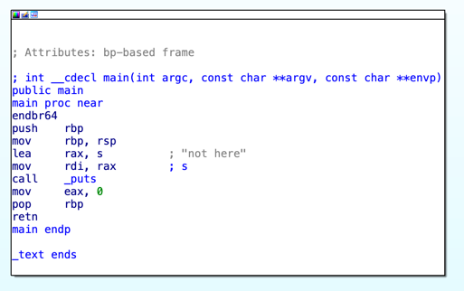
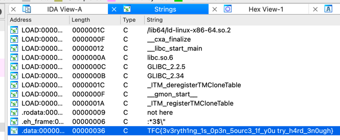

# SOURCE

My intern likes to hide things in apps, but they don't give me the source code.
What can I do?

# SOLUTION

let's check the `main` function:

nothing interesting here, let's check if there are strings in the binary:

the flag is just stored in the program in plain text.
