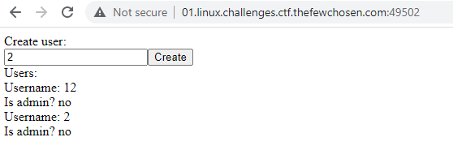
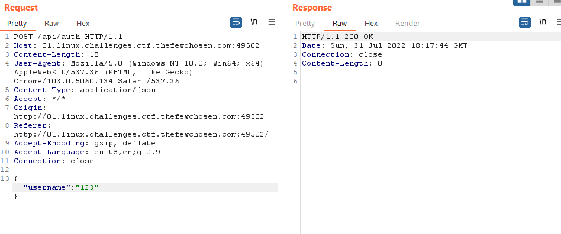
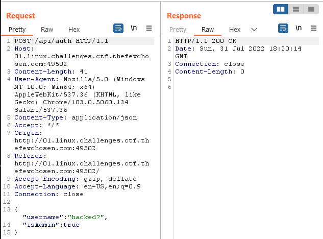
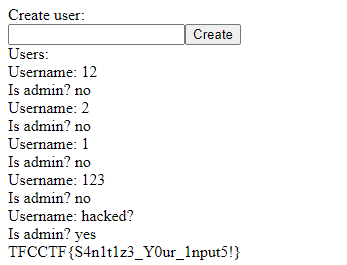

# ARE YOU THE ADMIN?

Do you have what it takes to be the admin?

`http://01.linux.challenges.ctf.thefewchosen.com:49502`

[index.tsx](index.tsx) [auth.ts](auth.ts) [schema.prisma](schema.prisma)

# SOLUTION

let's review the attached files:

`index.tsx`

this code makes sure that if a user is an admin: <br>
its sets the flag for that user: <br>
`user.flag = process.env.FLAG!;`

`auth.ts`

this code creates a user based on the `body` it gets.

`schema.prisma`

this code shows us that a user is constructed from those properties <br>
```
  id       String  @id @default(uuid())
  username String
  isAdmin  Boolean @default(false)
```

now let's navigate to the site: 



nothing interesting here, let's fire up `Burp Suite`,
I want to see the request that is being sent when pressing the `Create` button:



the site sends a json object with a username sets to whatever we enter,
what will happen if we add a member to the json called `isAdmin` and set it to `true`?



we will be admin!



the flag is:

`TFCCTF{S4n1t1z3_Y0ur_1nput5!}`
