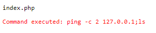
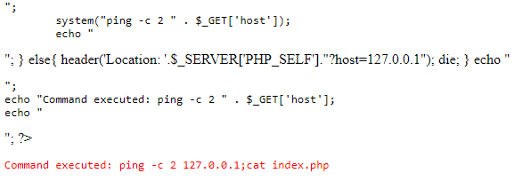
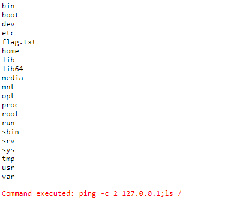
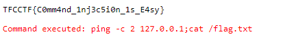

# PONG

Some random website that can ping hosts.

`http://01.linux.challenges.ctf.thefewchosen.com:49493`

# SOLUTION

when navigating to the url we are redirected to this url:

`http://01.linux.challenges.ctf.thefewchosen.com:49493/index.php?host=127.0.0.1`

and we get the next output:

`Command executed: ping -c 2 127.0.0.1`

this php script uses the `host` parameter and concatenate his value to the command is executing.

maybe there is a command injection vulnerability that we can abuse using the char `;`
that is used to execute multiple commands in the same line.

if we pass `127.0.0.1;ls` to the `host` parameter we get the next output:

we can also check the source code of index by injecting ;cat index.php,

and we can see that out assumption was correct!

we can not navigate in the file system,
but we can use the ls command with a directory, lets execute `ls /` for example:

and luckily for us the flag is stored here, so we can just `cat` it:

and we got the flag:

`TFCCTF{C0mm4nd_1nj3c5i0n_1s_E4sy}`
